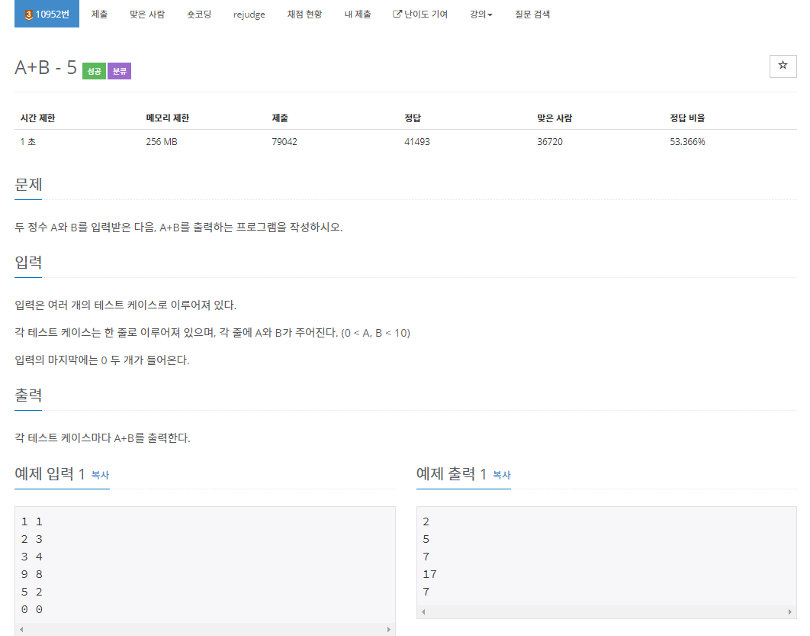

# BOJ 10952번 

[문제출처]: https://www.acmicpc.net/problem/10952	"10952"

1. break로 반복문 탈출
2. 위 코드와 아래 코드의 차이는 위에는 입력을 0 0 했을 때 0이 나오고 아래는 입력 0 0 했을 때 아무것도 안나오고 반복문이 탈출된다. 따라서 이 문제는 조건이 입력 0 0 했을 때 아무것도 안나오므로 아래의 코드가 맞다!

